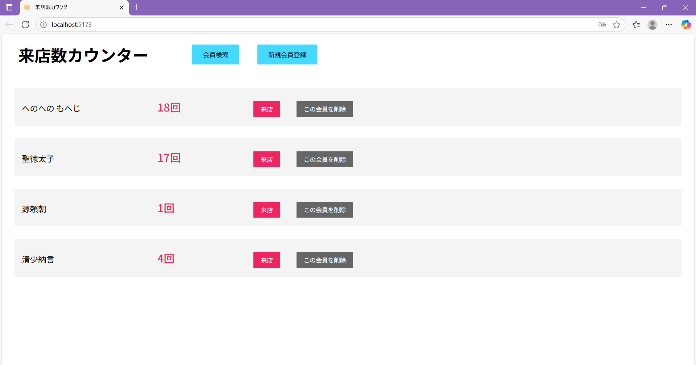

# 👣 来店数カウンター
このプロジェクトは2025年7月に作成しました。

Reactで作成した動画埋め込み用アプリです。  
会員別に来店数を管理できます。

---

## 🔗 デモ

- **サイトURL**  
  [https://yourname-portfolio.vercel.app](https://yourname-portfolio.vercel.app)

- **スクリーンショット**  
  

---

## 🛠 使用技術

　　


---

## 💡 工夫した点

- デジタルに不慣れな方でも扱いやすいシンプルな設計
- 新規会員登録と削除機能で流動的な会員に対応
- ローカルストレージで最低限の管理ができる

---

## 🚀 セットアップ方法

1. リポジトリをクローン

```bash
git clone https://github.com/kanikamaster/App2.git
cd rauten-counter
```

２，依存パッケージをインストール

```bash
npm install
```

3 開発用サーバーを起動

```bash
npm run dev
```

4 ターミナルまたは表示されたURLをクリックしてブラウザで確認

```bash
http ://localhost:5173
```
---

## 🖼 ポートフォリオサイトについて

ポートフォリオサイトは別リポジトリで管理しています。  
以下のリンクをご参照ください。

[ポートフォリオサイト リポジトリはこちら](https://github.com/kanikamaster/Portfolio)

---

## 📌 6. 作者プロフィール

- 名前：A.A
- 学校：K大学 情報学部
- 興味：Webアプリ開発 / UIデザイン / チーム開発
- GitHub：[github.com/kanikamaster](https://github.com/kanikamaster)

